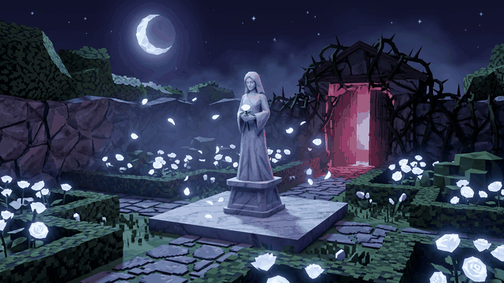

# Lilith's Lullaby: White Rose Sanctuary

A **Majora's Mask: Recompiled** mod that adds a new ocarina song, a hidden garden, and a brand new dungeon.



* **Lilith's Lullaby**, a new warp song. Play it and the real Song of Soaring wind effect whisks you away to...
* **The White Rose Sanctuary**, a moonlit garden of never-wilting white roses, guarded by a statue of Lilith and a gate of white roses that only opens to her song.
* **The Thornbound Crypt**, the dungeon beneath it. Between the Sanctuary and the Crypt: **3 new enemies, 2 new bosses and 4 new puzzles**.

The mod is **self contained**: it has no dependencies (no Scene API, no custom actor library) and it uses no assets other than what the game itself already contains.

> **Status: built and statically validated, not yet playtested in the game.** The code compiles and links against the game's
> decompilation headers, the mod tool resolves every game function and data symbol the mod uses, the song detection and
> the dungeon layout have automated tests, and I rendered the generated levels and models to check them by eye. What has
> *not* been done is running it inside Zelda 64: Recompiled, because that needs a game ROM and the desktop runtime. Expect
> some rough edges (balance, visuals, edge cases), and please report what you find. See
> [docs/DESIGN.md](docs/DESIGN.md#verification-and-known-limitations) for exactly what is and isn't verified.

## Install

1. Get `lilith_lullaby_white_rose.nrm` (from `dist/` in this repo, from a [CI build artifact](../../actions), or build it yourself, see below).
2. Put it in the `mods` folder of Zelda 64: Recompiled (Settings -> Mods -> *Open Mods Folder*), then enable it in the mod menu. Needs Zelda 64: Recompiled 1.2.2 or newer.

## How to play

### The song

Take out the Ocarina of Time and play:

| 1 | 2 | 3 | 4 | 5 | 6 | 7 |
|---|---|---|---|---|---|---|
| **C-Up** | **C-Left** | **C-Right** | **C-Left** | **C-Up** | **C-Left** | **C-Down** |

It works anywhere the **Song of Soaring** works (it is blocked in the same places), in any form. You do not need to "learn" it;
it is not in the Quest Status menu. Its melody does not overlap with any song in the game (checked automatically, see
[tools/tests](tools/tests)).

* **Outside the mod's areas** the song starts a Song of Soaring warp (feathers, wind capsule) to the Sanctuary. The game
  remembers *exactly where you were standing*.
* **Inside the Sanctuary or the Crypt** the song takes you back to that exact spot (or to Clock Town, if the game was
  restarted since you warped in and it no longer knows where you were), with one exception: if something wants to hear it
  first (see below), it is used up on that instead of taking you away.

### The White Rose Sanctuary

You arrive at the south end of the garden. Walk north to **Lilith's statue** and play the song again while you are close to
her (anywhere on the plaza around her): her halo beats faster while she is waiting for you. The **gate of white roses** in the north hedge sinks into the
ground. Beyond it a short tunnel ends in a glowing **rose circle** that leads into the Crypt.

The other rose circle, in the south east of the garden, takes you home (as does the song, once the gate is open).

### The Thornbound Crypt (spoilers)

| # | Area | What's there |
|---|------|--------------|
| 1 | **Entry Hall** | Two dormant **Thornlings** and a **pressure plate** (puzzle) that raises the first gate. |
| 2 | **Petal Gallery** | A wave arena: three **Petal Wisps**, then two Thornlings and two more Wisps. The next gate opens when it is clear. |
| 3 | **Sentinel Hall** | A wave arena of **Rose Knights**. |
| 4 | **Path Room** | The **Petal Path** (puzzle): four pads light up in a pattern (N, W, E, W, N: the start of the lullaby), repeat it by stepping on them. |
| 5 | **Bramble Hall** | Two walls of **brambles** (puzzle). Burn them (fire arrows, burning sticks) or blast them (bombs). Bomb flowers are provided. |
| 6 | **Warden Arena** | Mid boss: the **Thorn Warden** (drops a Piece of Heart). |
| 7 | **Boss Arena** | The **Queen of Thorns** (drops a Heart Container, and opens a rose circle home). |

Progress (opened gates, defeated bosses) is kept like in a real temple, including across the three day reset.

**The song is a weapon in here.** If any awake monster is near you when you play it, the lullaby lulls them to sleep for ten
seconds instead of warping you out. Sleeping monsters do not attack and take **double damage**. Play it again once
everything sleeps (or is dead) and it takes you home.

| Monster | Health | Notes |
|---------|--------|-------|
| **Thornling** | 3 | Lies dormant like a bramble bush until you get close, then rolls after you and lunges. |
| **Petal Wisp** | 2 | Floats and circles, throws petals from a distance, and dives at you. Use arrows, or strike while it recovers from a dive. |
| **Rose Knight** | 6 | Its shield stops sword, stick, arrow, boomerang, hookshot and Zora punch hits from the front. Hit it from behind or while it swings, use something heavy (bombs, spin attack, Goron attacks, fire/ice/light arrows, powder kegs), or put it to sleep with the song. |
| **Thorn Warden** | 18 | Slams his mace (a ring of petals and thorns at your feet), sweeps a line of thorns across the floor, then is exhausted for a moment: that is the window to hit him (double damage). The song also exhausts him. |
| **Queen of Thorns** | 36 | Three phases (petal spirals, thorn rings, summoned Wisps). In phases 1 and 2 she rests on the ground after a few attacks. In **phase 3 she can only be hurt while she sleeps, and she only sleeps to Lilith's Lullaby.** Sleeping doubles your damage. |

Health is in the game's own units: a Kokiri Sword slash does 1, the Razor Sword 2, the Gilded Sword 3, and strong slashes
(jump, flip, third in a combo) double that. Balance has not been playtested, so expect to want to tune it.

### Good to know

* **Time stands still** inside the Sanctuary and the Crypt (the clock does not advance), so you can take your time.
* **Saving/autosave:** the mod makes sure the game never saves an entrance that only exists inside this mod: saving in the Crypt brings you back to where you warped from.
* **Death:** you restart at the Crypt entrance with your progress kept.
* There is **no custom music, dialogue, title card or minimap**: the game's own music (Fairy Fountain, Ikana Castle, mini boss, boss) is reused, and the only hint system is the statue's pulsing halo.

## Compatibility

* No dependencies. It only **hooks** game functions (it patches nothing), so it coexists with other mods that do the same.
* It claims two unused scene slots (`SCENE_UNSET_3A`, `SCENE_UNSET_31`), two unused entrance slots (`ENTR_SCENE_UNSET_37`, `ENTR_SCENE_UNSET_2E`) and 13 unused entries of the actor table (picked at runtime). The Scene API mod uses `SCENE_UNSET_01` / `ENTR_SCENE_UNSET_08`, so the two can be installed together.
* A mod that also redirects the destination of the Song of Soaring warp (`EnTest7_WarpCsWarp`) could conflict.

## Building from source

**Linux, macOS or WSL, one command** (installs nothing system wide; needs `git`, `python3` with `venv`, `make`, a C++20 compiler and internet access the first time):

```sh
tools/build_linux.sh
```

This sets up Zig (which bundles clang 18, the LLVM version the template recommends), fetches the decomp headers and symbol files at the commits pinned by this repo's submodules, builds `RecompModTool` from the commit behind N64Recomp's official `mod-tool-release`, compiles, and writes `dist/lilith_lullaby_white_rose.nrm`. The same script runs in CI (`.github/workflows/build.yml`), which uploads the mod as a build artifact.

**Windows or a manual setup:** follow the template instructions below (LLVM 18.1.8 + `make`, `git submodule update --init --recursive`, then `make` and `RecompModTool mod.toml build`).

### Project layout

```
mod.toml                      manifest
src/lullaby.c                 song detection, the two warp directions, autosave protection
src/lil_song_tracker.h        the melody matcher (dependency free, unit tested on the host)
src/scene_loader.c            loads the mod's own scenes (scene/entrance tables, room + scene data hooks)
src/actors/                   custom actors: props.c, arena.c, enemies.c, bosses.c, actor_common.c (registry, helpers)
src/gen/, include/lil_gen.h   GENERATED scene, collision, texture and model data (see below)
tools/gen_world.py            the generator for src/gen: edit the layout there, then run it
tools/preview.py              software renders of the generated levels/models (docs/previews/)
tools/tests/test_song.c       unit test for the song tracker
tools/build_linux.sh          one command build
docs/DESIGN.md                how it works, verification status, known limitations
```

To change the dungeon: edit `tools/gen_world.py` (the layout is plain Python: rooms, doors, pillars, actor placements, lighting), then

```sh
python3 tools/gen_world.py --check    # validates floors, spawns and that every route through the level is walkable
python3 tools/gen_world.py            # regenerates src/gen/* and include/lil_gen.h
python3 tools/preview.py              # optional: renders docs/previews (needs matplotlib + numpy)
```

## Credits and license

* Built on the [Zelda64Recomp mod template](https://github.com/Zelda64Recomp/MMRecompModTemplate) and the [zeldaret Majora's Mask decompilation](https://github.com/zeldaret/mm) headers.
* The custom scene loading technique follows the one used by Keanine's **Scene API** mod (CC0), and the custom actor registration idea is informed by ProxyMM's **CustomActor** (CC0); no code was copied from either, and this mod does not depend on them.
* The mod contains no game assets. All textures and models are generated by `tools/gen_world.py`.
* The thumbnail is AI generated artwork.
* Licensed under CC0 1.0 like the template (see `LICENSE`).

---

## Template notes (from the original MMRecompModTemplate README)

### Writing mods
See [this document](https://hackmd.io/fMDiGEJ9TBSjomuZZOgzNg) for an explanation of the modding framework, including how to write function patches and perform interop between different mods.

### Tools
You'll need to install `clang` and `make` to build this template.
* On Windows, using [chocolatey](https://chocolatey.org/) to install both is recommended. The packages are `llvm` and `make` respectively.
  * The LLVM 19.1.0 [llvm-project](https://github.com/llvm/llvm-project) release binary, which is also what chocolatey provides, does not support MIPS correctly. The solution is to install 18.1.8 instead, which can be done in chocolatey by specifying `--version 18.1.8` or by downloading the 18.1.8 release directly.
* On Linux, these can both be installed using your distro's package manager. You may also need to install your distro's package for the `lld` linker. On Debian/Ubuntu based distros this will be the `lld` package.
* On MacOS, these can both be installed using Homebrew. Apple clang won't work, as you need a mips target for building the mod code.

On Linux and MacOS, you'll need to also ensure that you have the `zip` utility installed.

You'll also need to grab a build of the `RecompModTool` utility from the releases of [N64Recomp](https://github.com/N64Recomp/N64Recomp). You can also build it yourself from that repo if desired.

### Building
* First, run `make` (with an optional job count) to build the mod code itself.
* Next, run the `RecompModTool` utility with `mod.toml` as the first argument and the build dir (`build` in the case of this template) as the second argument.
  * This will produce your mod's `.nrm` file in the build folder.
  * If you're on MacOS, you may need to specify the path to the `clang` and `ld.lld` binaries using the `CC` and `LD` environment variables, respectively.

### Updating the Majora's Mask Decompilation Submodule
Mods can also be made with newer versions of the Majora's Mask decompilation instead of the commit targeted by this repo's submodule.
To update the commit of the decompilation that you're targeting, follow these steps:
* Build the [N64Recomp](https://github.com/N64Recomp/N64Recomp) repo and copy the N64Recomp executable to the root of this repository.
  * Make sure you pass `KEEP_MDEBUG=1` to `make` when building the decomp in order to keep debug information. This must be done from a clean build if you have built the decomp already without `KEEP_MDEBUG=1`.
* Build the version of the Majora's Mask decompilation that you want to update to and copy the resulting .elf file to the root of this repository.
* Update the `mm-decomp` submodule in your clone of this repo to point to the commit you built in the previous step.
* Run `N64Recomp generate_symbols.toml --dump-context`
* Rename `dump.toml` and `data_dump.toml` to `mm.us.rev1.syms.toml` and `mm.us.rev1.datasyms.toml` respectively.
  * Place both files in the `Zelda64RecompSyms` folder.
* Try building.
  * If it succeeds, you're done.
  * If it fails due to a missing header, create an empty header file in the `include/dummy_headers` folder, with the same path.
    * For example, if it complains that `assets/objects/object_cow/object_cow.h` is missing, create an empty `include/dummy_headers/objects/object_cow.h` file.
  * If RecompModTool fails due to a function "being marked as a patch but not existing in the original ROM", it's likely that function you're patching was renamed in the Majora's Mask decompilation.
    * Find the relevant function in the map file for the old decomp commit, then go to that address in the new map file, and update the reference to this function in your code with the new name.
